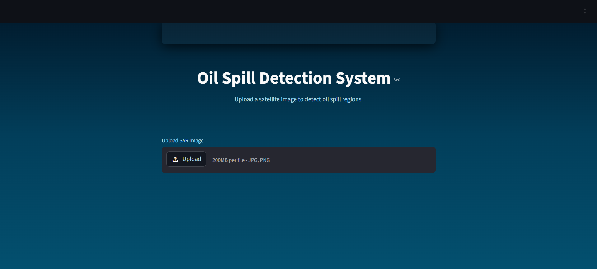
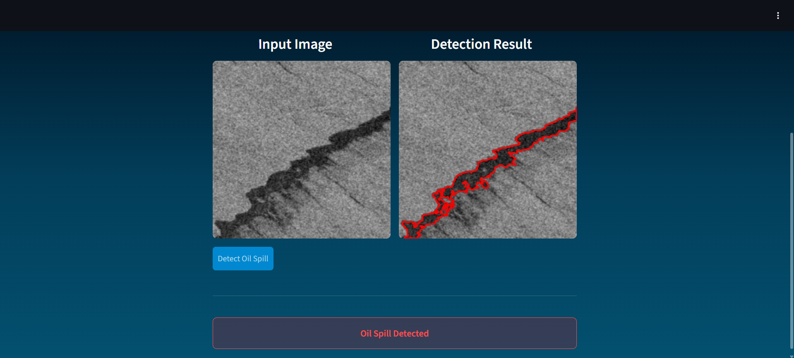
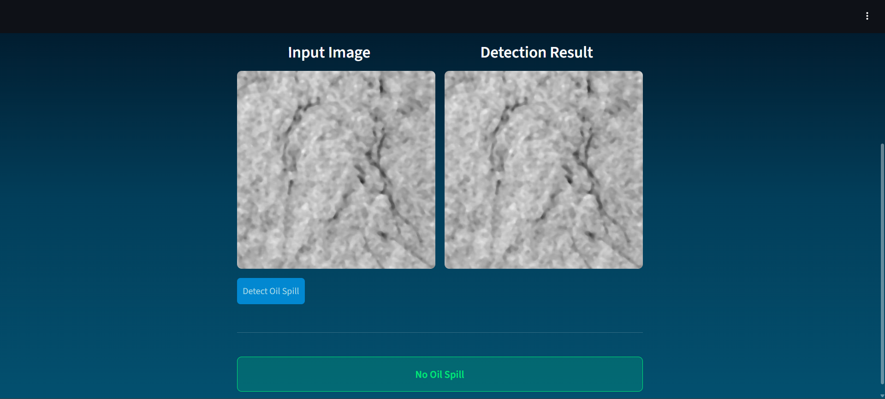
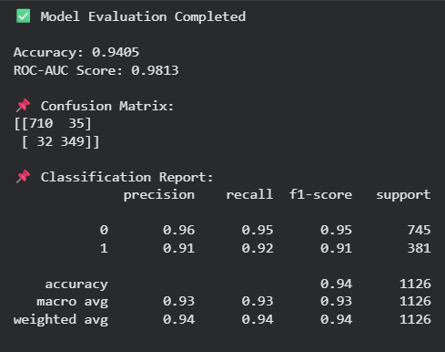

# Oil Spill Detection using Machine Learning and SAR Imagery

## Overview

This project focuses on detecting oil spill regions on ocean surfaces using SAR (Synthetic Aperture Radar) imagery and Machine Learning techniques.

A Random Forest-based classification pipeline was developed to analyze image features and identify potential oil spill areas. The project also includes a Streamlit-based interface for visualization and prediction.

This project was completed as part of academic coursework during the 4th semester of B.Tech CSE (AI/ML).

---

## Features

* SAR image preprocessing
* Feature extraction using:

  * GLCM
  * LBP
  * Entropy
  * Skewness
  * Kurtosis
* Handling imbalanced data using SMOTE
* Random Forest classification
* Hyperparameter tuning using GridSearchCV
* ROC-AUC and accuracy evaluation
* Streamlit visualization interface

---

## Technologies Used

* Python
* Scikit-learn
* NumPy
* Pandas
* OpenCV
* Matplotlib
* Streamlit

---

## Results

### Streamlit Interface

### Oil Spill Detection Output

### No Oil Spill Case

### Model Evaluation

---

## Dataset

Dataset used for this project:

https://www.kaggle.com/datasets/harikrishnacs/sentinel-1-sar-oil-spill-detection-dataset

---

## Team Members

* Aishwarya Pragada
* Sai Sneha Gunda
* Magarla Charishma
* Jaya Pranathi
* Jagalamarri Yasaswini
* Kollipara Niveditha

---

## Academic Context

This project was developed as part of an academic machine learning project focused on practical applications of AI in environmental monitoring and image-based analysis.
